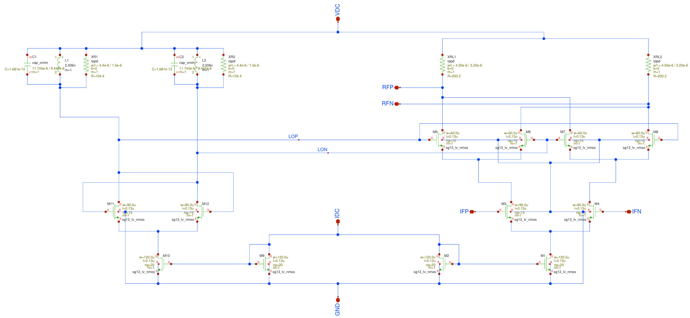
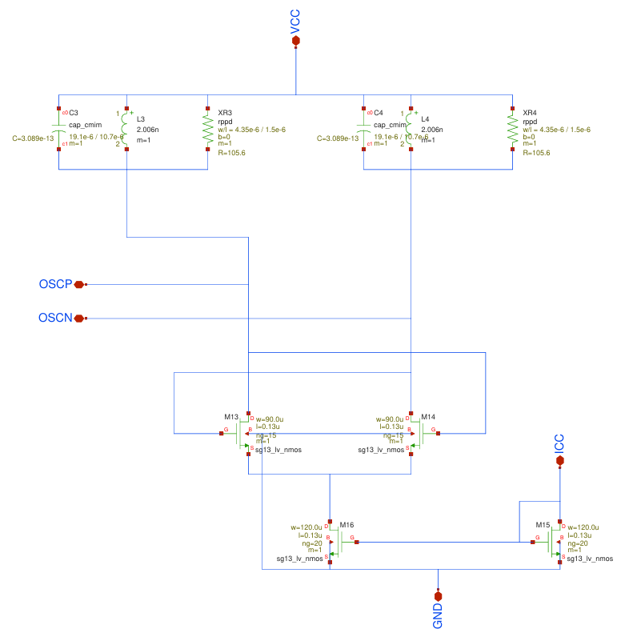
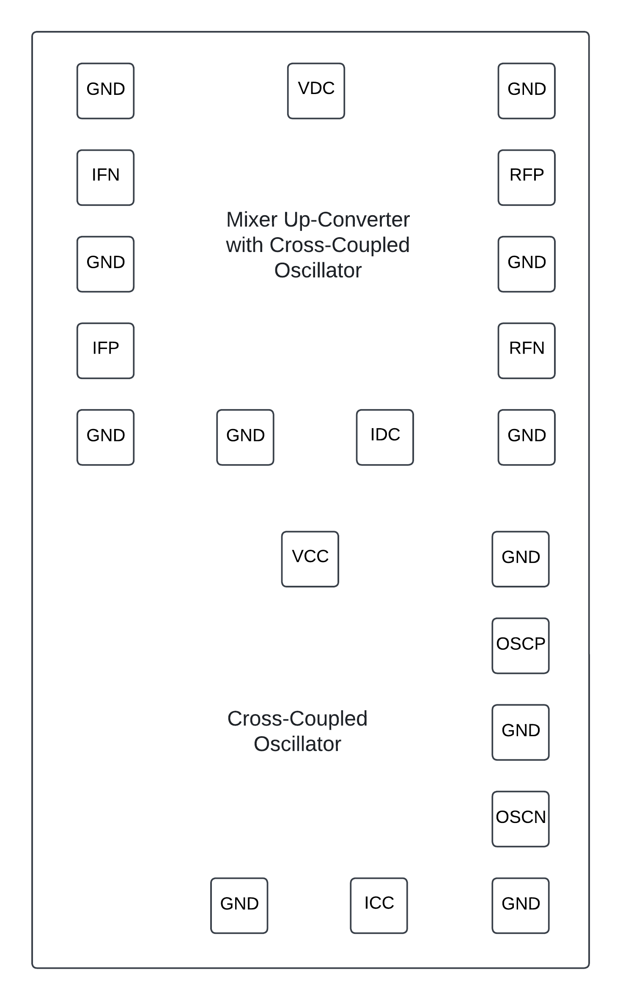
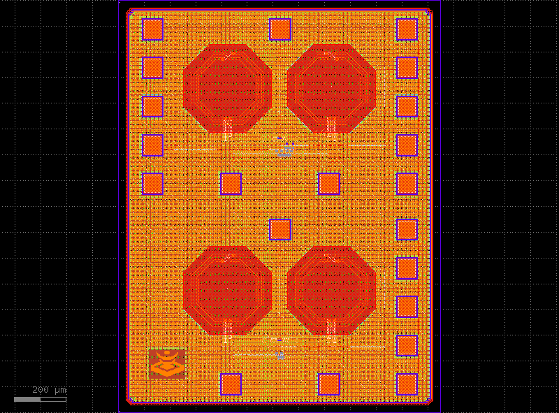

5 GHz Up-Converter Mixer with Cross-Coupled Oscillator
###################################

Understanding the operation of electronic circuits applied in low-temperature environments is crucial for the implementation of systems aimed at quantum computing. This is because, in cryogenic environments, material properties and device behavior can differ significantly from those observed at conventional temperatures.

To characterize circuits at both conventional and cryogenic temperatures, a chip was developed to test the behavior of the designs proposed below.

-	Mixer Up-Converter with Cross-Coupled Oscillator

-	Cross-Coupled Oscillator

Chip Pinout
###########

Mixer Up-Converter with Cross-Coupled Oscillator:

-	IFP and IFN: Differential input pair
-	RFP and RFN: Differential output pair
-	VDC: Power supply terminal
-	IDC: Bias current terminal
- GND: Ground terminal

Cross-Coupled Oscillator:

-	OSCP and OSCN: Differential output pair
-	VCC: Power supply terminal
-	ICC: Bias current terminal
- GND: Ground terminal

